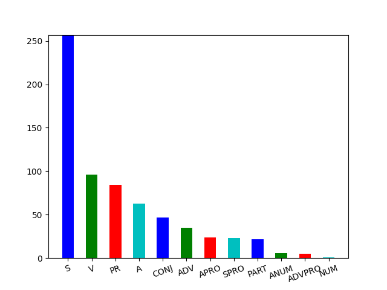

# Process raw data

> Python competencies required to complete this tutorial:
> * working with external dependencies, going beyond Python standard library
> * working with external modules: local and downloaded from PyPi
> * working with files: create/read/update
> * applying basic cleaning techniques to the raw text: tokenization, lemmatization
> * extracting linguistic data from the raw text: part of speech and its attributes

Processing data as a process contains following steps:
1. loading raw data
1. tokenizing the text
1. performing necessary transformations, such as lemmatization or stemming, and extract 
   valuable information from the text, such as detect each word part of speech.
1. saving necessary information

As a part of the second milestone, you need to implement processing logic as a `pipeline.py` module.
When it is run as a standalone Python program, it should perform all aforementioned stages.

## Executing pipeline

Example execution (`Windows`):

```bash
py pipeline.py
```

Expected result:
1. `N` raw texts collected as a result of scrapping are processed
1. each article has a processed version saved in the `tmp/articles` directory. `tmp` directory content:
```
+-- 2020-2-level-ctlr
    +-- tmp
        +-- articles
            +-- 1_raw.txt <- the paper with the ID as the name
            +-- 1_meta.json <- the paper meta-information
            +-- 1_processed.txt <- the tokenized, lemmatized, tagged paper text 
```

> NOTE: When using CI (Continuous Integration), generated `dataset.zip` is available in
> build artifacts. Go to `Actions` tab in GitHub UI of your fork, open the last job and
> if there is an artifact, you can download it.

## Configuring pipeline

Processing behavior is not configurable:

1. pipeline takes a raw dataset that is collected by
   `crawler.py` and placed at `ASSETS_PATH` (see `constants.py` for a particular place)
1. pipeline goes through each raw file, for example `1_raw.txt`
1. pipeline performs tokenization, lemmatization and morphological analysis of the text
1. resulting text with morphological tags is saved to a processed file, for example `1_processed.txt`

## Assessment criteria

You state your ambition on the mark by editing the file `target_score.txt` at the `line 5`. For example, such content:
```
...
# Target score for pipeline.py:
6
```
would mean that you have made tasks for mark `6` and request mentors to check if you can get it.

1. Desired mark: **4**:
   1. pylint level: `5/10`
   1. scrapper validates that raw dataset has a proper structure and fails appropriately if the latter is incorrect.
      Criteria:
        1. dataset exists (there is a folder)
        1. dataset is not empty (there are files inside)
        1. dataset is balanced: there are only files that follow the naming conventions:
            1. `N_raw.txt`, `N_meta.json`, where N is a valid number
            1. Numbers of articles are from 1 to N without any slips
   1. pipeline tokenizes text in each file, removes punctuation,
      and casts it to the lower case (*no lemmatization or tagging*)
      Example raw text: [config/test_files/0_raw.txt](./config/test_files/0_raw.txt). 
      Desired output: 
      [config/test_files/reference_score_four_test.txt](./config/test_files/reference_score_four_test.txt)
   1. pipeline produces only `N_processed.txt` files in the `tmp/articles`
1. Desired mark: **6**:
   1. pylint level: `7/10`
   1. all requirements for the mark **4**
   1. pipeline produces `N_processed.txt` files for each article, where each word is lemmatized and has
      a properly formatted tag.
      Example raw text: [config/test_files/0_raw.txt](./config/test_files/0_raw.txt). 
      Desired output: 
      [config/test_files/reference_test.txt](./config/test_files/reference_test.txt).
    1. pipeline uses pymystem3 library to perform lemmatization and tagging (more details in the description below) 
    1. pymystem3 tags are represented in angle brackets (within this tutorial we refer to it as a **pymystem-format**)
1. Desired mark: **8**:
   1. pylint level: `10/10`
   1. all requirements for the mark **6**
   1. pipeline additionally uses pymorphy2 library to perform tagging (more details in the description below)
      Example raw text: [config/test_files/0_raw.txt](./config/test_files/0_raw.txt). 
      Desired output: 
      [config/test_files/reference_score_eight_test.txt](./config/test_files/reference_score_eight_test.txt).
   1. pymorphy2 tags are represented in brackets (within this tutorial we refer to it as a **pymorphy2-format**)
1. Desired mark: **10**:
   1. pylint level: `10/10`
   1. all requirements for the mark **8**
   1. an additional pipeline is introduced `pos_pipeline.py` that:
      1. collects frequencies of parts of speech in each text
      1. extends `_meta.json` files with this information
      1. visualizes this distribution as png files that are created for each article
         and saved into `N_image.png` files

## Implementation tactics

> NOTE: all logic that instantiates needed abstractions and uses them should be implemented
> on the module level of the `pipeline.py`, in a special block
```py
def main():
    print('Your code goes here')

if __name__ == '__main__':
    main()
```

### Stage 0. Collect raw dataset with your scrapper.py

You will not be able to start your implementation if there is no collected dataset.
Dataset is collected by scrapper.py. Therefore, if you still do not have it working,
fix all the issues. Health check would be existence of a raw dataset in the `tmp/articles`
folder on your computer. For more details on how to implement `scrapper.py` refer to the 
[scrapper tutorial](./scrapper.md).

### Stage 1. Validate dataset first

Pipeline expects that dataset is collected and even do not start working if it is not valid.
Very first thing that should happen after pipeline is run is validation of the dataset.

Interface to implement:

```py
def validate_dataset(dataset_path):
    pass
```

`dataset_path` is the path to the dataset. It is mandatory to call this
method with passing a global variable `ASSETS_PATH` that should be properly
imported from the `constants.py` module.

Example call:

```py
validate_dataset(ASSETS_PATH)
```

When dataset is valid, method returns `None`.

When dataset is not valid:

1. one of the following errors is thrown (names of 
   errors are self-explaining):
   `FileNotFoundError`, `NotADirectoryError`, `InconsistentDatasetError`,
   `EmptyDirectoryError`, and throw `UnknownDatasetError` if
   any other inconsistency is found.
2. script immediately finishes execution

### Stage 2. Introduce corpus abstraction: CorpusManager

As we discussed multiple times when there are real world entities that we are working
with from our Python programs, we need to emulate their behavior by new abstractions.
If we think of the Pipeline and consider the Single Responsibility Principle, we will quickly
realize that it is not the responsibility of the Pipeline to know where the dataset files
are located and how to read/write to them, etc. Therefore, we need a new abstraction to be
responsible for these tasks. We call it `CorpusManager`.

#### Stage 2.1 Introduce CorpusManager abstraction

CorpusManager is an entity that knows where the dataset is placed and what are the available
files of this dataset.

CorpusManager should be instantiated with the following instruction:

```py
corpus_manager = CorpusManager(path_to_dataset=ASSETS_PATH)
```

CorpusManager instance saves all constructor arguments in attributes with
corresponding names. Each instance should also have an
additional attribute `self._storage` of a dictionary type and filled with
information about the files. For filling instructions read more in the next
stage (Stage 2.2).

#### Stage 2.2 Implement method for filling files storage

During initialization of the CorpusManager, it should scan the provided folder
path and register each dataset entry. All the storage is represented as 
`self._storage` attribute. Filling the storage should be done by executing this 
method:

```py
def _scan_dataset(self):
    pass
```

> NOTE: call this method during initialization and save the results in 
> `self._storage` attribute.

> SELF CHECK: Can you explain why the name of the method starts with underscore? 

The method should contain logic for iterating over the content of the folder, finding
all `_raw.txt` files and creating an `Article` instance for each file.

> NOTE: Article constructor expects URL as the first argument. It should be safe
> to pass None instead of the real URL. Pipeline does not need to know where was the 
> article downloaded from.

As it was stated before, `self._storage` attribute is just a dictionary. Keys are
ids of the files, values are instances of the `Article` class. For example,
pipeline finds a file `1_raw.txt`. Then we put new pair to the storage:

```py
self._storage[1] = Article(url=None, article_id=1)
```

#### Stage 2.3 Implement method for getting files storage

`self._storage` attribute is not a part of the CorpusManager interface, therefore we need 
a special getter - a method that just returns that storage value:

```py
def get_articles(self):
    pass
```

> SELF CHECK: Can you explain why might we need getters? 

> NOTE: `CorpusManager` knows where are the files, can easily find them by id,
> but it is not its responsibility to perform actual file reads and writes - it offloads
> it to the entity responsible for that - to the `Article` abstraction

### Stage 3. Introduce abstraction for elementary tokens in corpus: MorphologicalToken

`MorphologicalToken` is responsible for storing morphological analysis results and transforming them
into text format. As you already know, morphological analysis allows to study a particular word.
For example, analyzing `красивая` we can get a lemmatized version: `красивый` and word
attributes `A=им,ед,полн,жен`. `MorphologicalToken` is needed to store all this information.

#### Stage 3.1 Introduce MorphologicalToken abstraction

`MorphologicalToken` should be instantiated with the following instruction:

```py
token = MorphologicalToken(original_word, normalized_form)
```

`MorphologicalToken` instance saves all constructor arguments in attributes with
corresponding names. Each `MorphologicalToken` instance should also have following attributes:
`self.mystem_tags`, `self.pymorphy_tags` initialized with empty strings

#### Stage 3.2 Control MorphologicalToken casting to string

We will later use `MorphologicalToken` when writing processed text in file, therefore we need to
override the magic method `__str__(self)`:

```py
def __str__(self):
    pass
```

By default, the method should return the normalized word, stored in `self.normalized_form`.

### Stage 4. Introduce abstraction for processing texts in corpus: TextProcessingPipeline

Pipeline is responsible for applying processing techniques to the raw text, such as
tokenization, lemmatization, etc.

`TextProcessingPipeline` should be instantiated with the following instruction:

```py
corpus_manager = CorpusManager(...)
...
pipeline = TextProcessingPipeline(corpus_manager=corpus_manager)
```

`TextProcessingPipeline` instance constructor argument `corpus_manager` in attribute with
the same name.

### Stage 5. Implement core logic of TextProcessingPipeline

`TextProcessingPipeline` is executed with a simple interface method, that you need to implement:

```py
pipeline.run()
```

Once executed, `pipeline.run()` iterates through the available articles taken from `CorpusManager`, reads each file,
performs processing depending on the mark you want to get (see next steps) and writes processed text to files
with names following this convention: `N_processed.txt`.

> NOTE: it is mandatory to get articles with the `CorpusManager.get_articles` method

> NOTE: it is mandatory to read article with the `Article.get_raw_text` method

> NOTE: it is mandatory to write processed article with the `Article.save_processed` method

> Health check: try to implement `pipeline.run()` in a way that is goes through the articles 
> collected by `CorpusManager.get_articles`, reads each of them with `Article.get_raw_text`
> and then writes to the file as a processed article with the `Article.save_processed` method.
> At least you will see that everything works to this moment and you can proceed to implementing
> core logic of pipeline.

#### Stage 5.1. Implement simplified logic of TextProcessingPipeline (Stages 0-5.1 are required to get the mark 4)

> NOTE: ignore Stage 4.1 (current stage) if you want to get mark higher then 4, namely 6, 8, 10 - 
> you will implement a bit more meaningful processing.

> NOTE: if you decide to make a work for mark 4, then you should know that the dataset that you are going to
> generate will not follow the guidelines and requirements of your final project that you will make in groups.
> Please consider making the work for mark 6 at least.

For mark 4 you need to implement following processing:
1. tokenization (split into words),
1. punctuation removal,
1. casting to the lower case (*no lemmatization or tagging*)

Example raw text: [config/test_files/0_raw.txt](./config/test_files/0_raw.txt). 
Desired output: 
[config/test_files/reference_score_four_test.txt](./config/test_files/reference_score_four_test.txt)

All processing logic is encapsulated in the following protected method:

```py
def _process(self):
    pass
```

It returns the list of `MorphologicalToken` instances where each instance is initialized with 
the same word passed to both arguments, for example: 

```py
MorphologicalToken(original_word="красивая", normalized_form="красивая")
```

> NOTE: `_process` method should be called in the `run` method

#### Stage 5.2. Implement basic logic of TextProcessingPipeline (Stages 0-5.2 are required to get the mark 6)

For mark 4 you need to implement following processing:
1. tokenization,
1. punctuation removal,
1. casting to the lower case,
1. lemmatization,
1. morphological analysis,
1. tagging

Strong requirement is to use [pymystem3](https://pypi.org/project/pymystem3/) library for this task (steps 1-5 from
the list above).

> NOTE: it is recommended to use rely on pymystem ability to process text as a whole and perform
> lemmatization and morphological analysis at once. There are several reasons to do that,
> but from the linguistic perspective it would interesting for you to remember that 
> context-aware lemmatization works better that lemmatization of each word separately.

Use the following way to analyze the text:

```py
result = Mystem().analyze(text)
```

, where `text` is the text that you want to process, for example raw text of the article, and `result` is 
result of morphology analysis. Inspect the `result` as you need.

> NOTE: use debug or print the content of `result` - you will find everything you need there. 

> HINT: `result['text']` is likely to have the original word. Use the same approach to find tags and 
> normalized form

All processing logic is encapsulated in the following protected method:

```py
def _process(self):
    pass
```

It returns the list of `MorphologicalToken` instances where each instance:

1. is initialized with the original word and its normalized form, for example: 

```py
token = MorphologicalToken(original_word="раму", normalized_form="рама")
```

1. has mystem tags configured:

```py
token.mystem_tags = result[...]
```

> NOTE: `_process` method should be called in the `run` method

> NOTE: make sure you have adopted `__str__` method in the `MorphologicalToken` so that once these
> tokens are written to file, mystem tags appear there in angle brackets. 
> Example raw text: [config/test_files/0_raw.txt](./config/test_files/0_raw.txt). 
> Desired output: [config/test_files/reference_test.txt](./config/test_files/reference_test.txt). 

#### Stage 5.3. Implement advanced logic of TextProcessingPipeline (Stages 0-5.3 are required to get the mark 8)

For mark 8 you need to implement processing from Stage 5.2 plus:
1. morphological analysis with pymorphy2.

Strong requirement is to use [pymorphy2](https://pypi.org/project/pymorphy2/) library for morphological analysis.

> NOTE: it is recommended to have morphological analysis done after pymystem3. In other words, you extract 
> list of `MorphologicalToken` with pymystem3 and then iterate through them and fill each token with pymorphy2 tags.

You will need `MorphAnalyzer.parse` [docs](https://pymorphy2.readthedocs.io/en/stable/user/guide.html#id3).

> NOTE: make sure you have filled pymorphy2 tags in the token:
> ```py
> token.pymorphy_tags = ...
> ```

> NOTE: `_process` method contains all the processing logic, including additional analysis done with pymorphy2.

> NOTE: make sure you have adopted `__str__` method in the `MorphologicalToken` so that once these
> tokens are written to file, pymorphy tags appear there in brackets *after* mystem tags. 
> Example raw text: [config/test_files/0_raw.txt](./config/test_files/0_raw.txt). 
> Desired output: 
> [config/test_files/reference_score_eight_test.txt](./config/test_files/reference_score_eight_test.txt).

### Stage 6. Implement analytical pipeline: POSFrequencyPipeline (Stages 0-6 are required to get the mark 10)

We have just made the text processing pipeline. However, this is only the beginning of your 
linguistic research: you have the data and now need to start analyzing it, gaining insights, understanding it
and finding hidden meanings. During this stage we will make a small pipeline that will compute
distribution of various parts of speech in our texts, visualize it and, maybe, it will give better understanding of the text.

This is a sample result we are going to obtain: 


#### Stage 6.1. Introduce POSFrequencyPipeline abstraction

Create file `pos_frequency_pipeline.py` with a class `POSFrequencyPipeline`. All code should be written in
`main` function. `POSFrequencyPipeline` is instantiated in the similar manner as the `TextProcessingPipeline`:

```py
corpus_manager = CorpusManager(...)
...
pipeline = POSFrequencyPipeline(corpus_manager=corpus_manager)
```

#### Stage 6.2. Implement core logic of POSFrequencyPipeline

`POSFrequencyPipeline` is executed with a same interface method, that you need to implement:

```py
pipeline.run()
```

Once executed, `pipeline.run()`:
1. iterates through the available articles taken from `CorpusManager`,
1. reads each file,
1. calculates frequencies of each part of speech
1. writes them to the meta file
1. visualizes them (frequencies) in a form of images with names following this convention: `N_image.png`.

> NOTE: it is mandatory to get articles with the `CorpusManager.get_articles` method

> NOTE: it is mandatory to use `Article.get_raw_text` method

For visualization, you need to use `visualize` method from `visualizer.py` module available
in the root folder of the project. Sample usage:

```py
visualize(statistics=frequencies_dict, path_to_save='./tmp/articles/1_image.png')
```

#### Stage 6.3. Refactor your own code to use pathlib

As we discussed during lectures it is always better to have something designed specifically for the
given task. Comparing `os` and `pathlib` modules, the latter is the one that is designed for most of
filesystem related operations.

Make sure you use only `pathlib` in the code you write.

> NOTE: do not change modules external to your code, for example `article.py` - consider them as
> not available for installation. If you see a way to improve external modules, propose them in a 
> separate PR - mentors will review them separately and give you bonuses as any improvements are appreciated
